# 🛒 ShopSphere

ShopSphere is a full-stack e-commerce web application built using the MERN stack.

It provides a complete online shopping experience including authentication, product browsing, search, filtering, cart management, checkout, Razorpay payments, order management, and an admin dashboard.

---

## 🚀 Features

### 👤 User Features

- User registration and login
- JWT authentication
- Protected routes
- Product browsing
- Product search
- Category-based products
- Brand-based products
- Product details
- Product ratings and reviews display
- Shopping cart
- Increase/decrease cart quantity
- Remove products from cart
- Checkout
- Delivery address management
- Razorpay payment integration
- Payment verification
- Order placement
- Order history
- Order details
- Order status tracking
- Responsive UI

### 👨‍💼 Admin Features

- Admin authentication
- Admin dashboard
- Product management
- Add products
- Edit products
- Delete products
- Upload product images
- Featured products
- Order management
- Order details
- Update order status
- User management
- Role-based access control

---

## 🛠️ Technologies Used

### Frontend

- React.js
- React Router
- Axios
- Bootstrap
- JavaScript
- HTML5
- CSS3

### Backend

- Node.js
- Express.js
- MongoDB
- Mongoose
- JWT
- bcrypt
- Express Validator
- Razorpay
- Cloudinary

### Development Tools

- Git
- GitHub
- Postman
- MongoDB Atlas
- VS Code

---

## 📁 Project Structure

```text
ShopSphere/
│
├── client/
│   ├── public/
│   ├── src/
│   │   ├── assets/
│   │   ├── components/
│   │   ├── context/
│   │   ├── pages/
│   │   ├── services/
│   │   ├── utils/
│   │   ├── App.jsx
│   │   └── main.jsx
│   └── package.json
│
├── server/
│   ├── config/
│   ├── controllers/
│   ├── middlewares/
│   ├── models/
│   ├── routes/
│   ├── utils/
│   ├── server.js
│   └── package.json
│
├── screenshots/
│   ├── home.png
│   ├── products.png
│   ├── product-details.png
│   ├── cart.png
│   ├── checkout.png
│   ├── orders.png
│   ├── order-details.png
│   ├── admin-dashboard.png
│   ├── admin-products.png
│   └── admin-orders.png
│
├── .gitignore
└── README.md
```

---

## 📸 Screenshots

### 🏠 Home Page


### 🛍️ Products

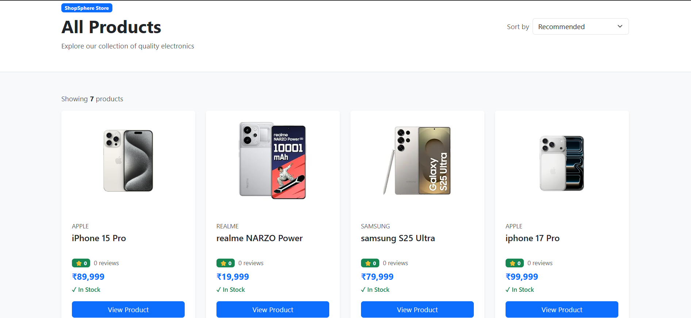

### 📱 Product Details

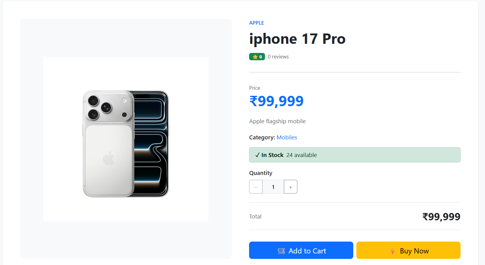

### 🛒 Shopping Cart

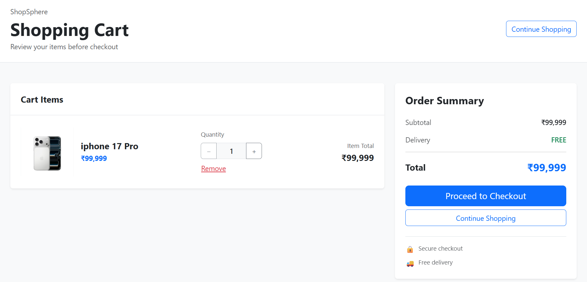

### 💳 Checkout

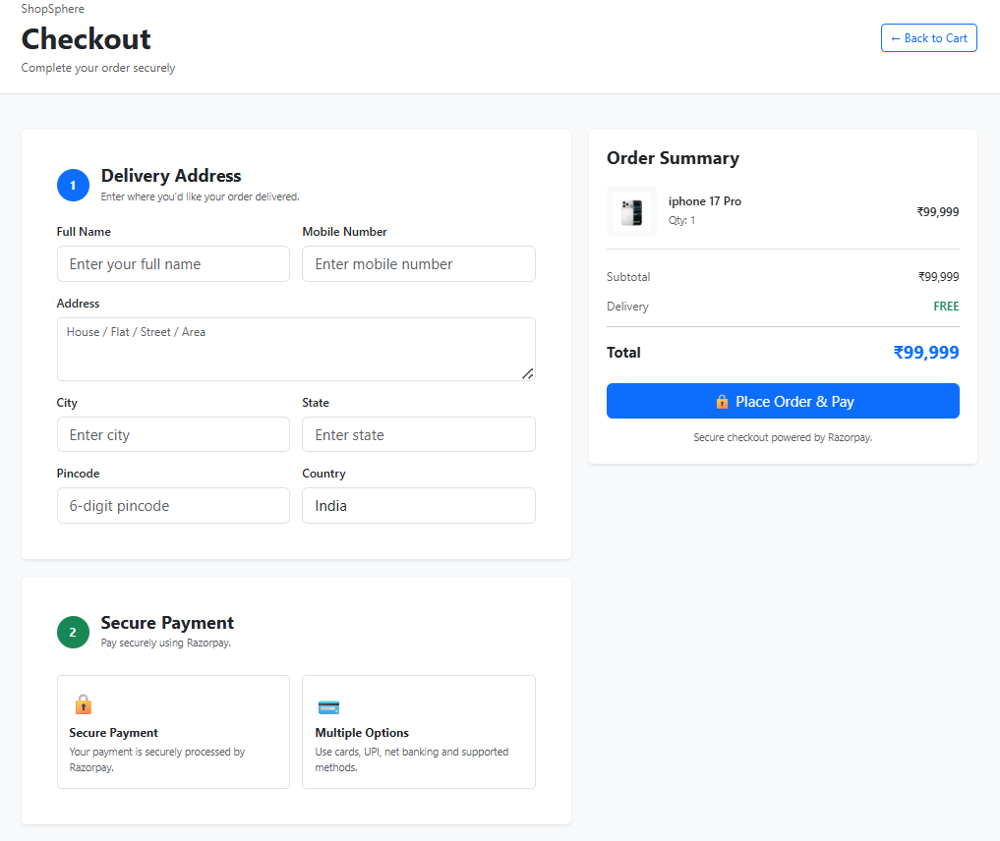

### 💳 Payment

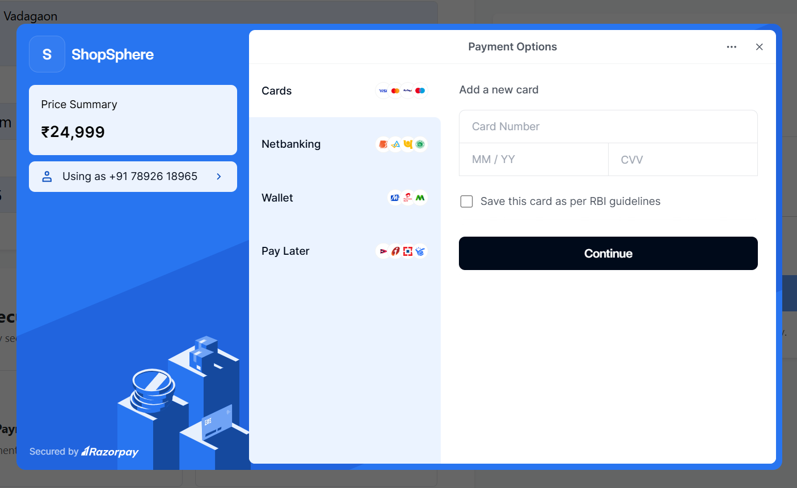

### 📦 My Orders

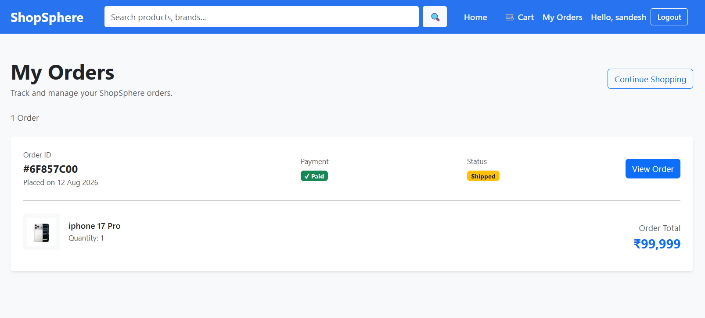

### 📋 Order Details

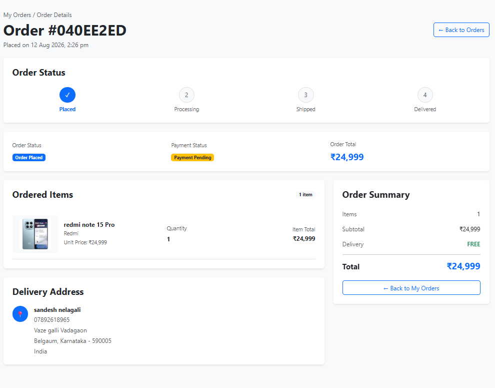

### 👨‍💼 Admin Dashboard

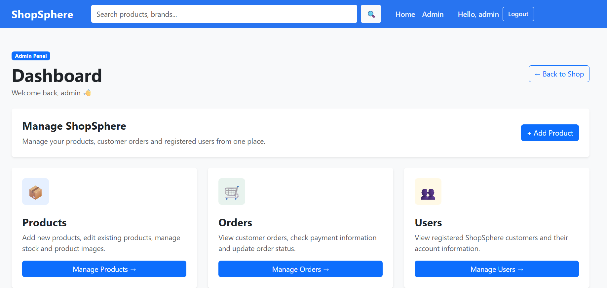

### 🛠️ Admin Product Management

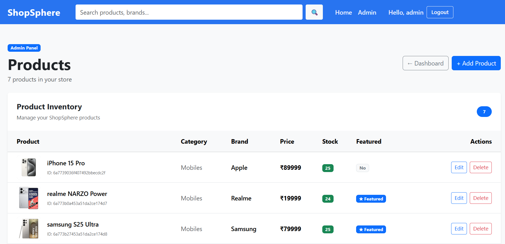

### 📦 Admin Order Management

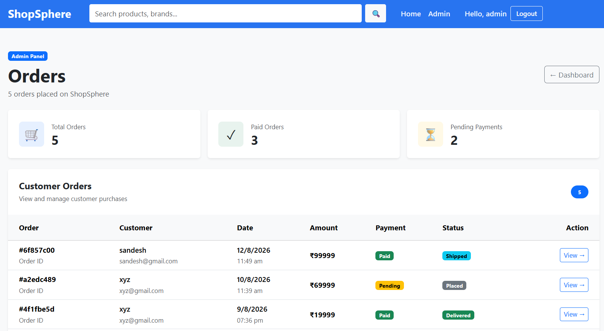

### 📦 Footer

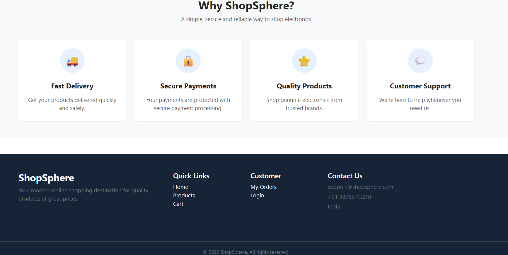
---

## 🔐 Authentication

ShopSphere uses JWT-based authentication to protect user and admin functionality.

```text
Register
   ↓
Login
   ↓
JWT Access Token
   ↓
Authenticated Requests
   ↓
Protected Routes
```

Admin users additionally have role-based access to the admin dashboard and management features.

---

## 💳 Payment Flow

ShopSphere uses Razorpay for online payments.

```text
Checkout
   ↓
Create ShopSphere Order
   ↓
Create Razorpay Order
   ↓
Open Razorpay Checkout
   ↓
Customer Payment
   ↓
Payment Response
   ↓
Backend Payment Verification
   ↓
Payment Successful
   ↓
Order Success
```

---

## 🗄️ Database

ShopSphere uses MongoDB as its database.

The production database is hosted using MongoDB Atlas.

Main collections include:

- Users
- Products
- Carts
- Orders

---

## 🔑 Environment Variables

Create a `.env` file inside the `server` directory.

Example:

```env
PORT=5000

MONGODB_URI=your_mongodb_connection_string

JWT_SECRET=your_jwt_secret
JWT_REFRESH_SECRET=your_refresh_token_secret

RAZORPAY_KEY_ID=your_razorpay_key_id
RAZORPAY_KEY_SECRET=your_razorpay_key_secret

CLOUDINARY_CLOUD_NAME=your_cloudinary_cloud_name
CLOUDINARY_API_KEY=your_cloudinary_api_key
CLOUDINARY_API_SECRET=your_cloudinary_api_secret

CLIENT_URL=http://localhost:5173
```

**Never commit your `.env` file or secret credentials to GitHub.**

---

## ⚙️ Installation

### 1. Clone the repository

```bash
git clone <your-github-repository-url>
cd ShopSphere
```

### 2. Install backend dependencies

```bash
cd server
npm install
```

### 3. Configure environment variables

Create:

```text
server/.env
```

Add your MongoDB Atlas, JWT, Razorpay, Cloudinary, and other required credentials.

### 4. Install frontend dependencies

```bash
cd ../client
npm install
```

### 5. Start the backend

```bash
cd ../server
npm run dev
```

The backend will run on:

```text
http://localhost:5000
```

### 6. Start the frontend

Open another terminal:

```bash
cd client
npm run dev
```

The frontend will run on the Vite development server.


---

## 🔮 Future Improvements

Possible future enhancements:

- Wishlist
- Product reviews and ratings
- Coupons and discounts
- Email notifications
- Advanced admin analytics
- Inventory alerts
- Order cancellation and refunds
- Multiple product images
- Product recommendations
- Advanced filtering
- Deployment monitoring

---

## 👨‍💻 Author

**Raghavendra Nelagali**

Full-Stack Developer | React | Node.js | Express | MongoDB

---

## 📄 License

This project is created for learning, portfolio, and demonstration purposes.